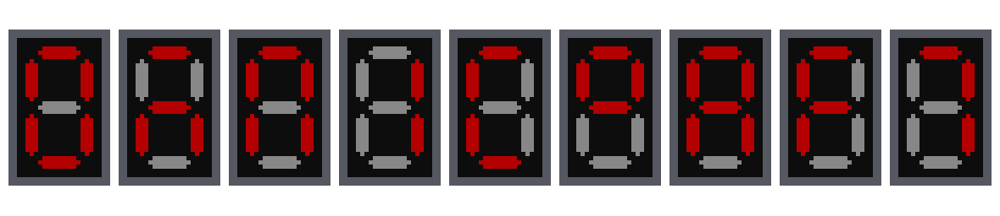

    

    
    
     
    
    
     
    

    
    

    
    
    
    

<h1>🚀 About</h1>

Omnicraft is made to consolidate different simple mods and adding new features.
The original idea was to shrink the number of mods to be used, since these days alot of old mods were
abandoned by the original author and people ported single items or blocks to new mods.
For example you need a mod for the tape measure, a mod for the openblocks elevator, etc.

<h1>🚀 Features</h1>

| Title                                                                   | Status         | Milestone                                                 | Created          | Updated          |
|-------------------------------------------------------------------------|----------------|-----------------------------------------------------------|------------------|------------------|
| [Tiny Coal](https://github.com/Subtixx/OmniCraft/issues/33)             | **_~~Done~~_** | [0.1.0](https://github.com/Subtixx/OmniCraft/milestone/3) | 09/09/2024 09:49 | 09/09/2024 21:17 |
| [Bronze](https://github.com/Subtixx/OmniCraft/issues/10)                | In review      | [0.1.0](https://github.com/Subtixx/OmniCraft/milestone/3) | 09/09/2024 09:03 | 09/09/2024 16:33 |
| [Steel](https://github.com/Subtixx/OmniCraft/issues/9)                  | In review      | [0.1.0](https://github.com/Subtixx/OmniCraft/milestone/3) | 09/09/2024 09:03 | 09/09/2024 16:33 |
| [Add silver resource](https://github.com/Subtixx/OmniCraft/issues/37)   | In review      | [0.1.0](https://github.com/Subtixx/OmniCraft/milestone/3) | 12/09/2024 13:24 | 12/09/2024 13:25 |
| [Add tin resource](https://github.com/Subtixx/OmniCraft/issues/38)      | In review      | [0.1.0](https://github.com/Subtixx/OmniCraft/milestone/3) | 12/09/2024 13:24 | 12/09/2024 13:25 |
| [Add lead resource](https://github.com/Subtixx/OmniCraft/issues/39)     | In review      | [0.1.0](https://github.com/Subtixx/OmniCraft/milestone/3) | 12/09/2024 13:24 | 12/09/2024 13:25 |
| [Add nickel resource](https://github.com/Subtixx/OmniCraft/issues/40)   | In review      | [0.1.0](https://github.com/Subtixx/OmniCraft/milestone/3) | 12/09/2024 13:24 | 12/09/2024 13:25 |
| [Add platinum resource](https://github.com/Subtixx/OmniCraft/issues/41) | In review      | [0.1.0](https://github.com/Subtixx/OmniCraft/milestone/3) | 12/09/2024 13:24 | 12/09/2024 13:25 |
| [Add titanium resource](https://github.com/Subtixx/OmniCraft/issues/43) | In review      | [0.1.0](https://github.com/Subtixx/OmniCraft/milestone/3) | 12/09/2024 13:24 | 12/09/2024 13:25 |
| [Add aluminum resource](https://github.com/Subtixx/OmniCraft/issues/44) | In review      | [0.1.0](https://github.com/Subtixx/OmniCraft/milestone/3) | 12/09/2024 13:24 | 12/09/2024 13:25 |
| [Add zinc resource](https://github.com/Subtixx/OmniCraft/issues/45)     | In review      | [0.1.0](https://github.com/Subtixx/OmniCraft/milestone/3) | 12/09/2024 13:24 | 12/09/2024 13:25 |
| [Add uranium resource](https://github.com/Subtixx/OmniCraft/issues/42)  | In review      | [0.1.0](https://github.com/Subtixx/OmniCraft/milestone/3) | 12/09/2024 13:24 | 12/09/2024 13:25 |

<h1>🐛 Issues</h1>

Please report any issues in the <a href="https://github.com/subtixx/OmniCraft/issues">GitHub Issues</a>.
This includes bugs, feature requests and documentation requests.

<h1>📝 Documentation</h1>

The documentation is hosted on GitHub pages. And can be found at 
<a href="https://subtixx.github.io/OmniCraft/">https://subtixx.github.io/OmniCraft/</a>

<h1>🗒 Changelog</h1>

The changelog can be found at <a href="https://github.com/subtixx/OmniCraft/blob/main/CHANGELOG.md">CHANGELOG.md</a>

<h1>🧾 Contributing</h1>

To contribute, please see the <a href="https://github.com/subtixx/OmniCraft/blob/main/CONTRIBUTING.md">CONTRIBUTING.md</a>

<h1>📝 License</h1>

I don't care about how you use this mod. 
Because of this the project is under MIT license.
Yes this also means that you can use it in your Modpacks.

